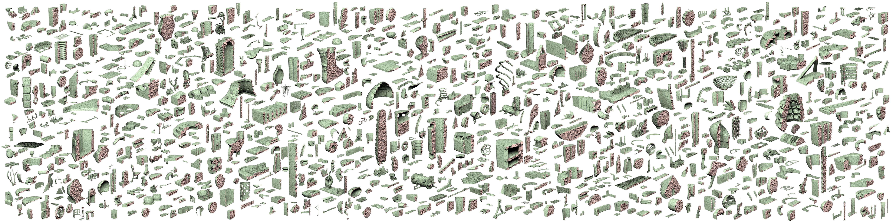

# Fast Tetrahedral Meshing in the Wild


Yixin Hu, Teseo Schneider, Bolun Wang, Denis Zorin, Daniele Panozzo.
ACM Transactions on Graphics (SIGGRAPH 2020)

```bash
\@article{10.1145/3386569.3392385,
author = {Hu, Yixin and Schneider, Teseo and Wang, Bolun and Zorin, Denis and Panozzo, Daniele},
title = {Fast Tetrahedral Meshing in the Wild},
year = {2020},
issue_date = {July 2020},
publisher = {Association for Computing Machinery},
address = {New York, NY, USA},
volume = {39},
number = {4},
issn = {0730-0301},
url = {https://doi.org/10.1145/3386569.3392385},
doi = {10.1145/3386569.3392385},
journal = {ACM Trans. Graph.},
month = jul,
articleno = {117},
numpages = {18},
keywords = {mesh generation, robust geometry processing, tetrahedral meshing}
}
```

## Important Updates

🚀 **C++20 Support**: The codebase has been upgraded to **C++20**.
🚀 **System Eigen**: Support for using system-installed Eigen library via `find_package`.
📖 **Documentation**: Detailed technical documentation is now available in [UserGuide.md](./docs/UserGuide.md).
🧪 **Testing & Benchmarks**: Added comprehensive unit tests, functional tests, and performance benchmarking tools.

## Installation via CMake

- Compile the code using cmake (requires C++20):

```bash
cd fTetWild
mkdir build
cd build
cmake ..
make -j8
```

### Dependencies
The project uses `FetchContent` to manage most dependencies automatically. However, you may need to install `gmp` manually:

- [homebrew](https://brew.sh/) on mac: `brew install gmp eigen`
- Package manager on Unix: `sudo apt-get install libgmp-dev libeigen3-dev`

## Testing & Benchmarking

### Running Tests
To run unit and functional tests:
```bash
ctest --output-on-failure
```

### Performance Benchmarks
To run the performance benchmark on a specific mesh:
```bash
./bench/ftetwild_bench ../tests/bunny.off
```

### Scalability Analysis
To analyze how the algorithm scales with multiple threads:
```bash
python3 ../bench/scalability_analysis.py ../tests/bunny.off
```

### Complexity Analysis
To evaluate scaling with increasing mesh resolution:
```bash
python3 ../bench/complexity_analysis.py
```

## Usage

### Command Line Switches
```
./FloatTetwild_bin [OPTIONS]
Options:
  -h,--help                   Print this help message and exit
  -i,--input TEXT:FILE        Input surface mesh INPUT in .off/.obj/.stl/.ply format. (string, required)
  -o,--output TEXT            Output tetmesh OUTPUT in .msh format.
  -l,--lr FLOAT               ideal_edge_length = diag_of_bbox * L (default: 0.05)
  -e,--epsr FLOAT             epsilon = diag_of_bbox * EPS (default: 1e-3)
  --max-threads UINT          Maximum number of threads used
```

For detailed information on all features, refer to the [User Guide](./docs/UserGuide.md).
